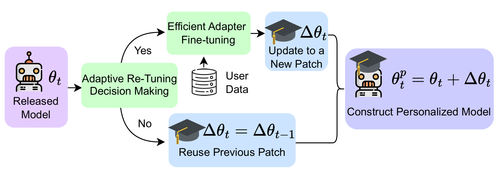

# EdgeTune: Efficient On-Device LLM Personalization at the Edge



This repository contains the core code for **EdgeTune**. EdgeTune is designed for **on-device LLM personalization** on resource-constrained edge platforms such as smartphones and embedded GPUs. 
We introduce two key ideas:

- **GradCut**: an importance-aware adapter placement method that reduces unnecessary LoRA fine-tuning cost by selecting where adaptation is most useful.
- **Adaptive Re-Tuning**: a lightweight reuse-or-re-tune policy that decides when an existing patch can be reused across model releases and when a new patch should be generated.

Together, these two components reduce the amortized cost of continual on-device personalization while preserving personalization quality.


## 1. Configure Paths and Hyperparameters

Before running the scripts, review:

- `GradCut/config.yaml`
- `ReTune/config.yaml`

Important items to check:

- base model name
- dataset/task prompt
- patch save directories
- sequence model directories
- training hyperparameters
- retuning policy hyperparameters

By default, the code assumes:

- the initial patch will be saved under `/your/path/patches_initial/`
- the sequence of your local base models (released from cloud) should be placed under `/your/path/sequence/local_thetat_{step:02}`
- generated patches will be saved under `/your/path/sequence/patches/`
- replace `/your/path` with your own directory.

Make sure these paths match your local setup.

## 2. Run GradCut

Go into the `GradCut/` directory first:

```bash
cd GradCut
```

### Phase 1

Phase 1 builds the first-stage patch artifact for a given step.

```bash
python gradcut_phase1.py --step 0
```

For later local models:

```bash
python gradcut_phase1.py --step 1
python gradcut_phase1.py --step 2
```

You can also provide a custom config file:

```bash
python gradcut_phase1.py --step 0 --config config.yaml
```

### Phase 2

Phase 2 consumes the phase1 output and produces the final patch artifact.

```bash
python gradcut_phase2.py --step 0
```

For later local models:

```bash
python gradcut_phase2.py --step 1
python gradcut_phase2.py --step 2
```

Custom config:

```bash
python gradcut_phase2.py --step 0 --config config.yaml
```

### Recommended Order

For each step, run:

```bash
python gradcut_phase1.py --step <step_id>
python gradcut_phase2.py --step <step_id>
```

Example:

```bash
python gradcut_phase1.py --step 0
python gradcut_phase2.py --step 0
```

## 3. Run ReTune

Go into the `ReTune/` directory:

```bash
cd ../ReTune
```

Run the retuning policy:

```bash
python retune_policy.py --config config.yaml
```

This script will:

- load the initial patch statistics
- iterate through the model sequence
- decide whether to reuse or retune patches
- save merged models under the configured merged output directory


## 4. Notes

- `--step 0` is used for the initial patch.
- `--step > 0` is used for local models in the sequence.
- Set `execution.auto_run_gradcut_on_ft_points: true` if you want `retune_policy.py` to automatically run GradCut at the initial patch and each required re-tune point.
- The current dataset/task in `GradCut/config.yaml` is only an example and can be replaced.
- To change model, dataset, prompt, or training knobs, prefer editing the YAML config instead of changing the script body.


# Reference
If you find our work helpful, please consider citing it as follows.
```
@inproceedings{edgetune2026wang,
    author = {Wang, Zhenyu and Khan, Rana Muhammad Shahroz and Chen, Tianlong and Nirjon, Shahriar},
    title = {EdgeTune: Efficient On-Device LLM Personalization at the Edge},
    year = {2026},
    isbn = {9798400723094},
    publisher = {Association for Computing Machinery},
    address = {New York, NY, USA},
    url = {https://doi.org/10.1145/3774906.3802769},
    doi = {10.1145/3774906.3802769},
    booktitle = {Proceedings of the 2026 ACM/IEEE International Conference on Embedded Artificial Intelligence and Sensing Systems},
    pages = {421–437},
    numpages = {17},
    series = {SenSys '26}
}
```
